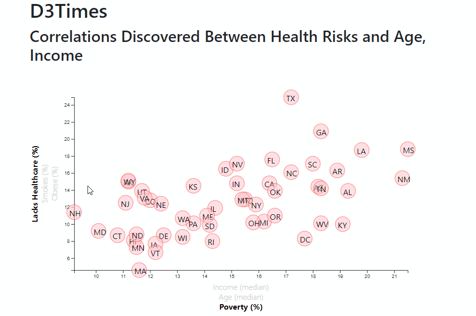

# D3-challenge

## background
The purpose of this project is to use [2014 ACS 1-year estimates data](assets/data/data.csv) in CSV format and build an interactive chart on a [webpage](https://jamess2eagle.github.io/D3-challenge/).  The dataset contains various aspects like healthcare, smoking, obesity, income, age and poverty data.

The website was built by using html, css and js.  D3 library was used to make the interactive tool-tips and the chart.  By selecting the axis titles, a user will be able to visualize and analyze the data.

## Preview

